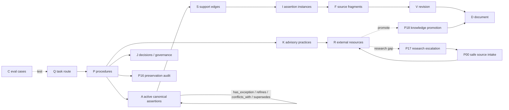

# Граф Wordraft — справочная схема

## Главное

- A/S/I/F/V/D — доказуемая policy.
- P/Q — executive function редактора.
- K/R — внешняя expertise без автоматического превращения в policy.
- J — explicit precedence/safety/preservation.
- C — regression harness.
